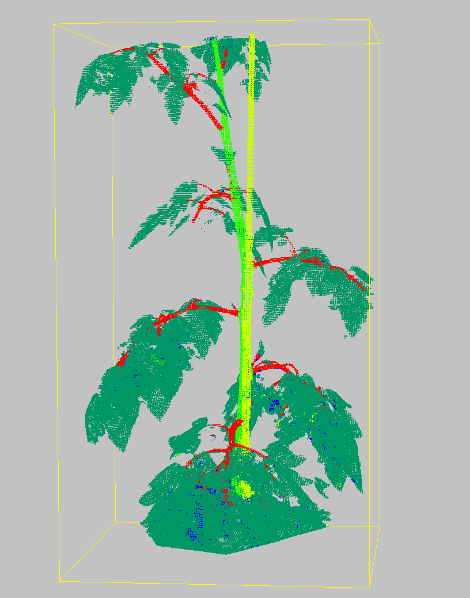
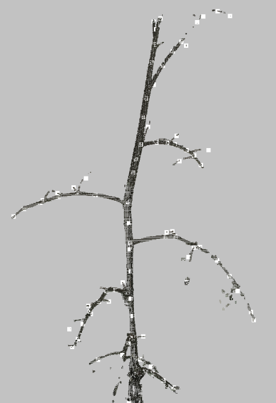

# Theme 6: Phenotyping Perception beyond 2D Colour

## The Challenge 

### Subtheme 3D skeletonisation: 

Accurate skeletonisation of 3D plants is crucial to determine the architecture of plants. This architecture is important to reduce the reality gap of 3D functional structural plant models and real plants.

In this sub challenge teams you will receive a dataset of ±42 segmented tomato plants, including ground truth skeleton. The main challenge is to develop an algorithm to correctly extract the nodes of these plant as accurate as possible. An example point cloud is shown below, in which the colours represent the classes: leaves, main stem, side stem and pole. The second image shows the output of the ground truth skeletonisation.

On top of this you will gain experience in working with 3D data to be able to use the provided framework for your own data.  

